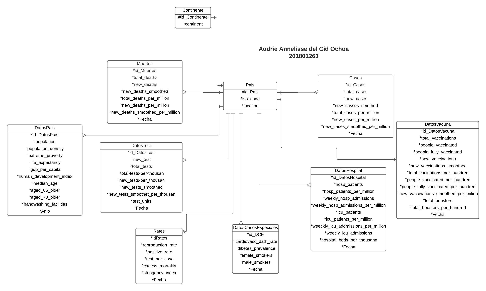

# [BD1]Práctica#1_201801263

# Marco Teórico

## Titulo 2

### Titulo 3

- Lista item 1
- Lista item 2
- Lista item 3 abajo una linea divisora

---

1. Lista con numeros 1
2. Lista con números 2 y abajo para llamar documentos

### Llamar Documentos

[Práctica Bases.pdf](%5BBD1%5DPra%CC%81ctica#1_201801263%2048a25974ba1b465dbf2db1f991952c2e/Prctica_Bases.pdf)

### Ecuaciones

$x=x^2 *5$

# Modelo Conceptual
|                    |
| :----------------------------------------------------------: |
| *Acceso al Modelo Conceptual Drive: [Click aquí](https://drive.google.com/file/d/1R6zWbpCRwDHAIuTfCu4N7rG1dLmHazNv/view?usp=sharing)* |

<br/>

### Entidad Continente
La entidad CONTINENTE se creó debido a que dentro de los datos brindados el continente era una forma de clasificación para la entidad que conforma datos realcionados al país. Esta entidad tiene una relación de uno a muchos con la entidad PAIS. Los atributos para esta entidad son los siguientes.

- id_Continente: Llave Primaria, permite identificar el continente.
- continent: Este dato contiene el nombre del Continente, no puede ser nulo.

### Entidad Pais
La entidad PAIS se creó debido a que dentro de los datos brindados clasificaban con ciertos atributos referentes a un país, los demás datos. Esta entidad tiene una relación de uno a muchos con varias entidades como Muertes, DatosPais, DatosTest, Rates, DatosCasosEspeciales, DatosHospital, Casos y DatosVacuna. Los atributos para esta entidad son los siguientes.

- id_Pais: Llave primaria, permite identificar al país
- iso_code: Atributo único. Codigo que identifica al País.
- location
- id_Continente: Clasifica a los países por continente.

### Entidad Muerte
La entidad MUERTE se creó debido a que dentro de los datos brindados existían aquellos que mostraban cifras totales de muerte respecto al virus Covid-19. Esta entidad tiene una relación de uno a muchos con la entidad País, debido a que dicha entidad puede tener diferentes datos de la entidad Muerte dependiendo de la fecha. Esta entidad consta de los siguientes atributos.

- id_Muertes: Llave primaria, permite identificar los datos de la entidad Muerte.
- total_deaths: Es la cifra total de muertos a la fecha.
- new_deaths: Número que indica la nueva cantidad de muertos registrados después del último registro.
- new_deaths_smoothed
- total_deaths_per_million
- new_deaths_per_million
- new_deaths_smoothed_per_million
- Fecha: Esta indica la fecha en la que fue realizado el registro. Es de caracter obligatorio.
- id_Pais: Llave foranea, permite relacionar la entidad Pais con la entidad Muerte mediante el id del País.

### Entidad Caso
La entidad CASO se creó debido a que dentro de los datos brindados existían aquellos que mostraban cifras totales de casos confirmados respecto al virus Covid-19. Esta entidad tiene una relación de uno a muchos con la entidad País, debido a que dicha entidad puede tener diferentes datos de la entidad CASO dependiendo de la fecha. Esta entidad consta de los siguientes atributos.

- id_Casos: Llave primaria, permite identificar los datos de la entidad Caso.
- total_deaths: Es la cifra total de casos a la fecha.
- new_deaths: Número que indica la nueva cantidad de casos registrados después del último registro.
- new_cases_smoothed
- total_cases_per_million
- new_cases_per_million
- new_cases_smoothed_per_million
- Fecha: Esta indica la fecha en la que fue realizado el registro. Es de caracter obligatorio.
- id_Pais: Llave foranea, permite relacionar la entidad Pais con la entidad Caso mediante el id del País.

### Entidad DatosHospital
La entidad DatosHospital se creó debido a que dentro de los datos brindados existían aquellos que mostraban cifras totales de pasientes confirmados respecto al virus Covid-19. Esta entidad tiene una relación de uno a muchos con la entidad País, debido a que dicha entidad puede tener diferentes datos de la entidad DatosHospital dependiendo de la fecha. Esta entidad consta de los siguientes atributos.

- id_DatosHopital: Llave primaria, permite identificar los datos de la entidad DatosHospital.
- hosp_patients: Es la cifra total de pacientes a la fecha.
- hosp_patients_per_million
- weekly_hsp_admissions
- weekly_hosp_admissions_per_million
- icu_patients
- icu_patients_per_million
- weeckly_icu_addmissions_per_million
- weekly_icu_admissions
- hospital_beds_per_thousand
- Fecha: Esta indica la fecha en la que fue realizado el registro. Es de caracter obligatorio.
- id_Pais: Llave foranea, permite relacionar la entidad Pais con la entidad Caso mediante el id del País.

### Entidad DatosPais
La entidad DatosPais se creó debido a que dentro de los datos brindados existían varios que mostraban cierta información del país, variando por año. Esta entidad tiene una relación de uno a muchos con la entidad País, debido a que dicha entidad puede tener diferentes datos de la entidad DatosPais dependiendo del año. Esta entidad consta de los siguientes atributos.

- id_DatosPais: Llave primaria, permite identificar los datos de la entidad.
- population: Contiene la información de la cantidad de población que hay en el país.
- population_density
- extreme_poverty
- life_expectancy: Contiene información de la esperanza de vida del País.
- gdp_per_capita
- human_development_index
- median_age
- aged_65_older
- aged_70_older
- hanwashing_facilities
- Año: Esta indica el año en la que fue realizado el registro dado que dichos datos no varían por fecha, sino que por año. Es de caracter obligatorio.
- id_Pais: Llave foranea, permite relacionar la entidad Pais con la entidad DatosPais mediante el id del País.


### Entidad DatosTest
La entidad DatosTest se creó debido a que dentro de los datos brindados existían varios que mostraban cierta información de las pruebas realizadas en el país para detectar el virus Covid-19. Esta entidad tiene una relación de uno a muchos con la entidad País, debido a que dicha entidad puede tener diferentes datos de la entidad DatosTest dependiendo de la Fecha. Esta entidad consta de los siguientes atributos.

- id_DatosTest: Llave primaria, permite identificar los datos de la entidad.
- new_test: Muestra la cantidad de nuevas pruebas realizadas respecto al último dato registrado.
- total_tests: Muestra el total de pruebas realizadas en el país.
- total_tests_per_thousan
- new_tests_per_thousan
- new_tests_smoothed
- new_tests_smoothet_per_thousan
- test_units
- Fecha: Esta indica la fecha en la que fue realizada el registro. Es de caracter obligatorio.
- id_Pais: Llave foranea, permite relacionar la entidad Pais con la entidad DatosPais mediante el id del País.

### Entidad Rates
La entidad Rates se creó debido a que dentro de los datos brindados existían varios que mostraban cierta información respecto a índices o porcentajes de ciertos datos variados en el país. Esta entidad tiene una relación de uno a muchos con la entidad País, debido a que dicha entidad puede tener diferentes datos de la entidad Rates dependiendo de la Fecha. Esta entidad consta de los siguientes atributos.

- id_Rates: Llave primaria, permite identificar los datos de la entidad.
- new_testreproduction_rate
- positive_rate
- test_per_case
- excess_mortality
- strigency_index
- Fecha: Esta indica la fecha en la que fue realizada el registro. Es de caracter obligatorio.
- id_Pais: Llave foranea, permite relacionar la entidad Pais con la entidad Rates mediante el id del País.


### Entidad DatosEspeciales
La entidad DatosEspeciales se creó debido a que dentro de los datos brindados existían varios que mostraban cierta información respecto a casos especiales respecto a salud o costumbres perjudiciales para la salud en el país. Esta entidad tiene una relación de uno a muchos con la entidad País, debido a que dicha entidad puede tener diferentes datos de la entidad DatosEspeciales dependiendo de la Fecha. Esta entidad consta de los siguientes atributos.

- id_DCE: Llave primaria, permite identificar los datos de la entidad.
- cardiovasc_dat_rate
- diabetes_prevalence
- female_smokers
- male_smokers
- Fecha: Esta indica la fecha en la que fue realizada el registro. Es de caracter obligatorio.
- id_Pais: Llave foranea, permite relacionar la entidad Pais con la entidad DatosEspeciales mediante el id del País.

### Entidad DatosVacuna
La entidad DatosEspeciales se creó debido a que dentro de los datos brindados existían varios que mostraban cierta información respecto al suministro de vacunas en el país. Esta entidad tiene una relación de uno a muchos con la entidad País, debido a que dicha entidad puede tener diferentes datos de la entidad DatosEspeciales dependiendo de la Fecha. Esta entidad consta de los siguientes atributos.

- id_DatosVacuna: Llave primaria, permite identificar los datos de la entidad.
- total_vaccinations:Muestra el total de personas vacunadas con la primera dosis
- people vaccinated
- people_fully_vaccinated
- new_vaccinated
- new_vaccinations_per_hundred
- people_vaccinated_per_hundred
- people_fully_vaccinated_per_hundred
- new_vaccinations_smoothed_per_million
- total_boosters: Cantidad total de refuerso aplicados.
- total_boosters_per_hundred
- Fecha: Esta indica la fecha en la que fue realizada el registro. Es de caracter obligatorio.
- id_Pais: Llave foranea, permite relacionar la entidad Pais con la entidad DatosVacuna mediante el id del País.

# Modelo Lógico

<table class="tg" >
<thead>
  <tr>
    <th colspan="3">CONTINENTE</th>
  </tr>
</thead>
<tbody>
  <tr>
    <td class="tg-0pky">Columnas</td>
    <td class="tg-0pky">id_Contienente</td>
    <td class="tg-0lax">continent</td>
  </tr>
  <tr>
    <td class="tg-0pky">Restricciones</td>
    <td class="tg-0pky">PK</td>
    <td class="tg-0lax">NN</td>
  </tr>
  <tr>
    <td class="tg-0pky">1</td>
    <td class="tg-0pky">1</td>
    <td class="tg-0lax">Asia</td>
  </tr>
  <tr>
    <td class="tg-0pky">1</td>
    <td class="tg-0pky">2</td>
    <td class="tg-0lax">Europe</td>
  </tr>
  <tr>
    <td class="tg-0pky">2</td>
    <td class="tg-0pky">3</td>
    <td class="tg-0lax">Africa</td>
  </tr>
</tbody>
</table>


<table class="tg">
<thead>
  <tr>
    <th class="tg-c3ow" colspan="5">PAIS</th>
  </tr>
</thead>
<tbody>
  <tr>
    <td class="tg-0pky">Columnas</td>
    <td class="tg-0pky">id_Pais</td>
    <td class="tg-0lax">iso_code</td>
    <td class="tg-0lax">location</td>
    <td class="tg-0lax">id_Continente</td>
  </tr>
  <tr>
    <td class="tg-0pky">Restricciones</td>
    <td class="tg-0pky">PK</td>
    <td class="tg-0lax"> U NN</td>
    <td class="tg-0lax">NN</td>
    <td class="tg-0lax">FK NN</td>
  </tr>
  <tr>
    <td class="tg-0pky">1</td>
    <td class="tg-0pky">1</td>
    <td class="tg-0lax">AFG</td>
    <td class="tg-0lax">Afghanista</td>
    <td class="tg-0lax">1</td>
  </tr>
  <tr>
    <td class="tg-0pky">2</td>
    <td class="tg-0pky">2</td>
    <td class="tg-0lax">ALB</td>
    <td class="tg-0lax">Albania</td>
    <td class="tg-0lax">2</td>
  </tr>
  <tr>
    <td class="tg-0pky">3</td>
    <td class="tg-0pky">3</td>
    <td class="tg-0lax">OWID_AFR</td>
    <td class="tg-0lax">Africa</td>
    <td class="tg-0lax">3</td>
  </tr>
</tbody>
</table>


<table class="tg">
<thead>
  <tr>
    <th class="tg-c3ow" colspan="10">MUERTE</th>
  </tr>
</thead>
<tbody>
  <tr>
    <td class="tg-0pky">Columnas</td>
    <td class="tg-0pky">id_Muertes</td>
    <td class="tg-0pky">total_deaths</td>
    <td class="tg-0pky">new_deaths</td>
    <td class="tg-0pky">new_deaths_smoothed</td>
    <td class="tg-0lax">total_deaths_per_million</td>
    <td class="tg-0pky">new_deaths_per_million</td>
    <td class="tg-0lax">new_deaths_smoothed_per_million</td>
    <td class="tg-0lax">Fecha</td>
    <td class="tg-0lax">id_Pais</td>
  </tr>
  <tr>
    <td class="tg-0pky">Restricciones</td>
    <td class="tg-0pky">PK</td>
    <td class="tg-0pky"></td>
    <td class="tg-0pky"></td>
    <td class="tg-0pky"></td>
    <td class="tg-0lax"></td>
    <td class="tg-0pky"></td>
    <td class="tg-0lax"></td>
    <td class="tg-0lax">NN</td>
    <td class="tg-0lax">FK NN</td>
  </tr>
  <tr>
    <td class="tg-0pky">1</td>
    <td class="tg-0pky">1</td>
    <td class="tg-0pky"></td>
    <td class="tg-0pky"></td>
    <td class="tg-0pky"></td>
    <td class="tg-0lax"></td>
    <td class="tg-0pky"></td>
    <td class="tg-0lax"></td>
    <td class="tg-0lax">24/02/2020</td>
    <td class="tg-0lax">1</td>
  </tr>
  <tr>
    <td class="tg-0pky">2</td>
    <td class="tg-0pky">2</td>
    <td class="tg-0pky">300540</td>
    <td class="tg-0pky">2420</td>
    <td class="tg-0pky">252286</td>
    <td class="tg-0lax">21882</td>
    <td class="tg-0pky">176</td>
    <td class="tg-0lax">184</td>
    <td class="tg-0lax">01/09/2020</td>
    <td class="tg-0lax">2</td>
  </tr>
  <tr>
    <td class="tg-0pky">3</td>
    <td class="tg-0pky">3</td>
    <td class="tg-0pky">4690</td>
    <td class="tg-0pky">40</td>
    <td class="tg-0pky">3714</td>
    <td class="tg-0lax">102185</td>
    <td class="tg-0pky">1392</td>
    <td class="tg-0lax">1293</td>
    <td class="tg-0lax">23/10/2020</td>
    <td class="tg-0lax">3</td>
  </tr>
</tbody>
</table>


<table class="tg">
<thead>
  <tr>
    <th class="tg-c3ow" colspan="10">CASO</th>
  </tr>
</thead>
<tbody>
  <tr>
    <td class="tg-0pky">Columnas</td>
    <td class="tg-0pky">id_Casos</td>
    <td class="tg-0pky">total_cases</td>
    <td class="tg-0pky">new_cases</td>
    <td class="tg-0pky">new_cases_smoothed</td>
    <td class="tg-0pky">total_cases_per_million</td>
    <td class="tg-0pky">new_cases_per_million</td>
    <td class="tg-0pky">new_cases_smoothed_per_million</td>
    <td class="tg-0pky">Fecha</td>
    <td class="tg-0pky">id_Pais</td>
  </tr>
  <tr>
    <td class="tg-0pky">Restricciones</td>
    <td class="tg-0pky">PK</td>
    <td class="tg-0pky"></td>
    <td class="tg-0pky"></td>
    <td class="tg-0pky"></td>
    <td class="tg-0pky"></td>
    <td class="tg-0pky"></td>
    <td class="tg-0pky"></td>
    <td class="tg-0pky">NN</td>
    <td class="tg-0pky">FK NN</td>
  </tr>
  <tr>
    <td class="tg-0pky">1</td>
    <td class="tg-0pky">1</td>
    <td class="tg-0pky">10</td>
    <td class="tg-0pky">10</td>
    <td class="tg-0pky"> </td>
    <td class="tg-0pky">25</td>
    <td class="tg-0pky">25</td>
    <td class="tg-0pky"> </td>
    <td class="tg-0pky">24/02/2020</td>
    <td class="tg-0pky">1</td>
  </tr>
  <tr>
    <td class="tg-0pky">2</td>
    <td class="tg-0pky">2</td>
    <td class="tg-0pky">12593920</td>
    <td class="tg-0pky">71580</td>
    <td class="tg-0pky">8045286</td>
    <td class="tg-0pky">916931</td>
    <td class="tg-0pky">5212</td>
    <td class="tg-0pky">5858</td>
    <td class="tg-0pky">01/09/2020</td>
    <td class="tg-0pky">2</td>
  </tr>
  <tr>
    <td class="tg-0pky">3</td>
    <td class="tg-0pky">3</td>
    <td class="tg-0pky">185560</td>
    <td class="tg-0pky">3060</td>
    <td class="tg-0pky">293571</td>
    <td class="tg-0pky">6458902</td>
    <td class="tg-0pky">106511</td>
    <td class="tg-0pky">102185</td>
    <td class="tg-0pky">23/10/2020</td>
    <td class="tg-0pky">3</td>
  </tr>
</tbody>
</table>


<table class="tg">
<thead>
  <tr>
    <th class="tg-c3ow" colspan="13">DATOSHOSPITAL</th>
  </tr>
</thead>
<tbody>
  <tr>
    <td class="tg-0pky">Columnas</td>
    <td class="tg-0pky">id_DatosHospital</td>
    <td class="tg-0pky">hosp_patients</td>
    <td class="tg-0pky">hosp_patients_per_million</td>
    <td class="tg-0pky">weekly_hosp_admissions</td>
    <td class="tg-0pky">weeekly_hosp_addmissions_per_million</td>
    <td class="tg-0pky">icu_patients</td>
    <td class="tg-0pky">icu_patients_per_million</td>
    <td class="tg-0pky">weekly_icu_addmissions_per_million</td>
    <td class="tg-0pky">weekly_icu_addmisions</td>
    <td class="tg-0lax">hospital_beds_per_thousand</td>
    <td class="tg-0lax">Fecha</td>
    <td class="tg-0lax">id_Pais</td>
  </tr>
  <tr>
    <td class="tg-0pky">Restricciones</td>
    <td class="tg-0pky">PK</td>
    <td class="tg-0pky"></td>
    <td class="tg-0pky"></td>
    <td class="tg-0pky"></td>
    <td class="tg-0pky"></td>
    <td class="tg-0pky"></td>
    <td class="tg-0pky"></td>
    <td class="tg-0pky"></td>
    <td class="tg-0pky"></td>
    <td class="tg-0lax"></td>
    <td class="tg-0lax">NN</td>
    <td class="tg-0lax">FK NN</td>
  </tr>
  <tr>
    <td class="tg-0pky">1</td>
    <td class="tg-0pky">1</td>
    <td class="tg-0pky"> </td>
    <td class="tg-0pky"></td>
    <td class="tg-0pky"></td>
    <td class="tg-0pky"></td>
    <td class="tg-0pky"></td>
    <td class="tg-0pky"></td>
    <td class="tg-0pky"></td>
    <td class="tg-0pky"></td>
    <td class="tg-0lax">5</td>
    <td class="tg-0lax">24/02/2020</td>
    <td class="tg-0lax">1</td>
  </tr>
  <tr>
    <td class="tg-0pky">2</td>
    <td class="tg-0pky">2</td>
    <td class="tg-0pky"> </td>
    <td class="tg-0pky"></td>
    <td class="tg-0pky"></td>
    <td class="tg-0pky"></td>
    <td class="tg-0pky"></td>
    <td class="tg-0pky"></td>
    <td class="tg-0pky"></td>
    <td class="tg-0pky"></td>
    <td class="tg-0lax"> </td>
    <td class="tg-0lax">01/09/2020</td>
    <td class="tg-0lax">2</td>
  </tr>
  <tr>
    <td class="tg-0pky">3</td>
    <td class="tg-0pky">3</td>
    <td class="tg-0pky"> </td>
    <td class="tg-0pky"></td>
    <td class="tg-0pky"></td>
    <td class="tg-0pky"></td>
    <td class="tg-0pky"></td>
    <td class="tg-0pky"></td>
    <td class="tg-0pky"></td>
    <td class="tg-0pky"></td>
    <td class="tg-0lax">289</td>
    <td class="tg-0lax">23/10/2020</td>
    <td class="tg-0lax">3</td>
  </tr>
</tbody>
</table>


<table class="tg">
<thead>
  <tr>
    <th class="tg-c3ow" colspan="13">DATOSPAIS</th>
    <th class="tg-0lax"></th>
  </tr>
</thead>
<tbody>
  <tr>
    <td class="tg-0pky">Columnas</td>
    <td class="tg-0pky">id_DatosPais</td>
    <td class="tg-0pky">population</td>
    <td class="tg-0pky">population_density</td>
    <td class="tg-0pky">extreme_poverty</td>
    <td class="tg-0pky">life_expectancy</td>
    <td class="tg-0pky">gdp_per_capita</td>
    <td class="tg-0pky">human_development_index</td>
    <td class="tg-0pky">median_age</td>
    <td class="tg-0pky">aged_65_older</td>
    <td class="tg-0lax">age_70_older</td>
    <td class="tg-0lax">handwashing_facilities</td>
    <td class="tg-0lax">Anio</td>
    <td class="tg-0lax">id_Pais</td>
  </tr>
  <tr>
    <td class="tg-0pky">Restricciones</td>
    <td class="tg-0pky">PK</td>
    <td class="tg-0pky"></td>
    <td class="tg-0pky"></td>
    <td class="tg-0pky"></td>
    <td class="tg-0pky"></td>
    <td class="tg-0pky"></td>
    <td class="tg-0pky"></td>
    <td class="tg-0pky"></td>
    <td class="tg-0pky"></td>
    <td class="tg-0lax"></td>
    <td class="tg-0lax"></td>
    <td class="tg-0lax">NN</td>
    <td class="tg-0lax">FK NN</td>
  </tr>
  <tr>
    <td class="tg-0pky">1</td>
    <td class="tg-0pky">1</td>
    <td class="tg-0pky">398354280</td>
    <td class="tg-0pky">54422</td>
    <td class="tg-0pky"> </td>
    <td class="tg-0pky">6483</td>
    <td class="tg-0pky">1803987</td>
    <td class="tg-0pky">511</td>
    <td class="tg-0pky">186</td>
    <td class="tg-0pky">2581</td>
    <td class="tg-0lax">1337</td>
    <td class="tg-0lax">37746</td>
    <td class="tg-0lax">24/02/2020</td>
    <td class="tg-0lax">1</td>
  </tr>
  <tr>
    <td class="tg-0pky">2</td>
    <td class="tg-0pky">2</td>
    <td class="tg-0pky">137350000000000</td>
    <td class="tg-0pky"> </td>
    <td class="tg-0pky"> </td>
    <td class="tg-0pky"> </td>
    <td class="tg-0pky"> </td>
    <td class="tg-0pky"> </td>
    <td class="tg-0pky"> </td>
    <td class="tg-0pky"> </td>
    <td class="tg-0lax"> </td>
    <td class="tg-0lax"> </td>
    <td class="tg-0lax">01/09/2020</td>
    <td class="tg-0lax">2</td>
  </tr>
  <tr>
    <td class="tg-0pky">3</td>
    <td class="tg-0pky">3</td>
    <td class="tg-0pky">28729340</td>
    <td class="tg-0pky">104871</td>
    <td class="tg-0pky">1.1</td>
    <td class="tg-0pky">7857</td>
    <td class="tg-0pky">11803431</td>
    <td class="tg-0pky">795</td>
    <td class="tg-0pky">380</td>
    <td class="tg-0pky">13188</td>
    <td class="tg-0lax">8643</td>
    <td class="tg-0lax"> </td>
    <td class="tg-0lax">23/10/2020</td>
    <td class="tg-0lax">3</td>
  </tr>
</tbody>
</table>


<table class="tg">
<thead>
  <tr>
    <th class="tg-c3ow" colspan="11">DATOSTEST</th>
  </tr>
</thead>
<tbody>
  <tr>
    <td class="tg-0pky">Columnas</td>
    <td class="tg-0pky">id_DatosTest</td>
    <td class="tg-0pky">new_test</td>
    <td class="tg-0pky">total_tests</td>
    <td class="tg-0pky">total_tests_per_thousan</td>
    <td class="tg-0pky">new_tests_per_thousan</td>
    <td class="tg-0pky">new_tests_smoothed</td>
    <td class="tg-0pky">new_tests_smmothed_per_thousan</td>
    <td class="tg-0pky">test_units</td>
    <td class="tg-0pky">Fecha</td>
    <td class="tg-0lax">id_Pais</td>
  </tr>
  <tr>
    <td class="tg-0pky">Restricciones</td>
    <td class="tg-0pky">PK</td>
    <td class="tg-0pky"></td>
    <td class="tg-0pky"></td>
    <td class="tg-0pky"></td>
    <td class="tg-0pky"></td>
    <td class="tg-0pky"></td>
    <td class="tg-0pky"></td>
    <td class="tg-0pky"></td>
    <td class="tg-0pky">NN</td>
    <td class="tg-0lax">FK NN</td>
  </tr>
  <tr>
    <td class="tg-0pky">1</td>
    <td class="tg-0pky">1</td>
    <td class="tg-0pky"> </td>
    <td class="tg-0pky"> </td>
    <td class="tg-0pky"> </td>
    <td class="tg-0pky"> </td>
    <td class="tg-0pky"> </td>
    <td class="tg-0pky"> </td>
    <td class="tg-0pky"> </td>
    <td class="tg-0pky">24/02/2020</td>
    <td class="tg-0lax">1</td>
  </tr>
  <tr>
    <td class="tg-0pky">2</td>
    <td class="tg-0pky">2</td>
    <td class="tg-0pky"> </td>
    <td class="tg-0pky"> </td>
    <td class="tg-0pky"> </td>
    <td class="tg-0pky"> </td>
    <td class="tg-0pky"> </td>
    <td class="tg-0pky"> </td>
    <td class="tg-0pky"></td>
    <td class="tg-0pky">01/09/2020</td>
    <td class="tg-0lax">2</td>
  </tr>
  <tr>
    <td class="tg-0pky">3</td>
    <td class="tg-0pky">3</td>
    <td class="tg-0pky">1412.0</td>
    <td class="tg-0pky">1099912.0</td>
    <td class="tg-0pky">38.258</td>
    <td class="tg-0pky">0.491</td>
    <td class="tg-0pky">1368.0</td>
    <td class="tg-0pky">0.476</td>
    <td class="tg-0pky"></td>
    <td class="tg-0pky">23/10/2020</td>
    <td class="tg-0lax">3</td>
  </tr>
</tbody>
</table>


<table class="tg">
<thead>
  <tr>
    <th class="tg-c3ow" colspan="9">RATES</th>
  </tr>
</thead>
<tbody>
  <tr>
    <td class="tg-0pky">Columnas</td>
    <td class="tg-0pky">idRates</td>
    <td class="tg-0pky">new_testresproduction_rate</td>
    <td class="tg-0pky">postive_rate</td>
    <td class="tg-0pky">test_per_case</td>
    <td class="tg-0pky">excess_morality</td>
    <td class="tg-0pky">strigency_index</td>
    <td class="tg-0pky">Fecha</td>
    <td class="tg-0lax">id_Pais</td>
  </tr>
  <tr>
    <td class="tg-0pky">Restricciones</td>
    <td class="tg-0pky">PK</td>
    <td class="tg-0pky"></td>
    <td class="tg-0pky"></td>
    <td class="tg-0pky"></td>
    <td class="tg-0pky"></td>
    <td class="tg-0pky"></td>
    <td class="tg-0pky">NN</td>
    <td class="tg-0lax">FK NN</td>
  </tr>
  <tr>
    <td class="tg-0pky">1</td>
    <td class="tg-0pky">1</td>
    <td class="tg-0pky"> </td>
    <td class="tg-0pky"> </td>
    <td class="tg-0pky"> </td>
    <td class="tg-0pky"> </td>
    <td class="tg-0pky">833</td>
    <td class="tg-0pky">24/02/2020</td>
    <td class="tg-0lax">1</td>
  </tr>
  <tr>
    <td class="tg-0pky">2</td>
    <td class="tg-0pky">2</td>
    <td class="tg-0pky"> </td>
    <td class="tg-0pky"> </td>
    <td class="tg-0pky"> </td>
    <td class="tg-0pky"> </td>
    <td class="tg-0pky"> </td>
    <td class="tg-0pky">01/09/2020</td>
    <td class="tg-0lax">2</td>
  </tr>
  <tr>
    <td class="tg-0pky">3</td>
    <td class="tg-0pky">3</td>
    <td class="tg-0pky"> </td>
    <td class="tg-0pky">0.215</td>
    <td class="tg-0pky">4.7</td>
    <td class="tg-0pky"> </td>
    <td class="tg-0pky">5463</td>
    <td class="tg-0pky">23/10/2020</td>
    <td class="tg-0lax">3</td>
  </tr>
</tbody>
</table>


<table class="tg">
<thead>
  <tr>
    <th class="tg-c3ow" colspan="8">DATOSCASOSESPECIALES</th>
  </tr>
</thead>
<tbody>
  <tr>
    <td class="tg-0pky">Columnas</td>
    <td class="tg-0pky">id_DCE</td>
    <td class="tg-0pky">cardiovasc_dath_rate</td>
    <td class="tg-0pky">diabetes_prevalence</td>
    <td class="tg-0pky">female_smokers</td>
    <td class="tg-0pky">male_smokers</td>
    <td class="tg-0pky">Fecha</td>
    <td class="tg-0lax">id_Pais</td>
  </tr>
  <tr>
    <td class="tg-0pky">Restricciones</td>
    <td class="tg-0pky">PK</td>
    <td class="tg-0pky"></td>
    <td class="tg-0pky"></td>
    <td class="tg-0pky"></td>
    <td class="tg-0pky"></td>
    <td class="tg-0pky">NN</td>
    <td class="tg-0lax">FK NN</td>
  </tr>
  <tr>
    <td class="tg-0pky">1</td>
    <td class="tg-0pky">1</td>
    <td class="tg-0pky">597029</td>
    <td class="tg-0pky">959</td>
    <td class="tg-0pky"> </td>
    <td class="tg-0pky"></td>
    <td class="tg-0pky">24/02/2020</td>
    <td class="tg-0lax">1</td>
  </tr>
  <tr>
    <td class="tg-0pky">2</td>
    <td class="tg-0pky">2</td>
    <td class="tg-0pky"> </td>
    <td class="tg-0pky"> </td>
    <td class="tg-0pky"> </td>
    <td class="tg-0pky"></td>
    <td class="tg-0pky">01/09/2020</td>
    <td class="tg-0lax">2</td>
  </tr>
  <tr>
    <td class="tg-0pky">3</td>
    <td class="tg-0pky">3</td>
    <td class="tg-0pky">304195</td>
    <td class="tg-0pky">1008</td>
    <td class="tg-0pky">7.1</td>
    <td class="tg-0pky">51.2</td>
    <td class="tg-0pky">23/10/2020</td>
    <td class="tg-0lax">3</td>
  </tr>
</tbody>
</table>


<table class="tg">
<thead>
  <tr>
    <th class="tg-c3ow" colspan="14">DATOSVACUNA</th>
  </tr>
</thead>
<tbody>
  <tr>
    <td class="tg-0pky">Columnas</td>
    <td class="tg-0pky">id_DatosVacuna</td>
    <td class="tg-0pky">total_vaccinations</td>
    <td class="tg-0pky">people_fully_vaccinated</td>
    <td class="tg-0pky">new_vaccinations</td>
    <td class="tg-0pky">new_vaccinations_smoothed</td>
    <td class="tg-0lax">total_vaccinations_per_hundred</td>
    <td class="tg-0lax">people_vaccinated_per_hundred</td>
    <td class="tg-0lax">people_fully_vaccuinated_per_hundred</td>
    <td class="tg-0lax">new_vaccinations_smoothed_per_million</td>
    <td class="tg-0lax">total_boosters</td>
    <td class="tg-0lax">total_bossters_per_hundred</td>
    <td class="tg-0pky">Fecha</td>
    <td class="tg-0pky">id_Pais</td>
  </tr>
  <tr>
    <td class="tg-0pky">Restricciones</td>
    <td class="tg-0pky">PK</td>
    <td class="tg-0pky"></td>
    <td class="tg-0pky"></td>
    <td class="tg-0pky"></td>
    <td class="tg-0pky"></td>
    <td class="tg-0lax"></td>
    <td class="tg-0lax"></td>
    <td class="tg-0lax"></td>
    <td class="tg-0lax"></td>
    <td class="tg-0lax"></td>
    <td class="tg-0lax"></td>
    <td class="tg-0pky">NN</td>
    <td class="tg-0pky">FK NN</td>
  </tr>
  <tr>
    <td class="tg-0pky">1</td>
    <td class="tg-0pky">1</td>
    <td class="tg-0pky"></td>
    <td class="tg-0pky"></td>
    <td class="tg-0pky"></td>
    <td class="tg-0pky"></td>
    <td class="tg-0lax"></td>
    <td class="tg-0lax"></td>
    <td class="tg-0lax"></td>
    <td class="tg-0lax"></td>
    <td class="tg-0lax"></td>
    <td class="tg-0lax"></td>
    <td class="tg-0pky">24/02/2020</td>
    <td class="tg-0pky">1</td>
  </tr>
  <tr>
    <td class="tg-0lax">2</td>
    <td class="tg-0lax">2</td>
    <td class="tg-0lax"></td>
    <td class="tg-0lax"></td>
    <td class="tg-0lax"></td>
    <td class="tg-0lax"></td>
    <td class="tg-0lax"></td>
    <td class="tg-0lax"></td>
    <td class="tg-0lax"></td>
    <td class="tg-0lax"></td>
    <td class="tg-0lax"></td>
    <td class="tg-0lax"></td>
    <td class="tg-0lax">01/09/2020</td>
    <td class="tg-0lax">2</td>
  </tr>
  <tr>
    <td class="tg-0lax">3</td>
    <td class="tg-0lax">3</td>
    <td class="tg-0lax"></td>
    <td class="tg-0lax"></td>
    <td class="tg-0lax"></td>
    <td class="tg-0lax"></td>
    <td class="tg-0lax"></td>
    <td class="tg-0lax"></td>
    <td class="tg-0lax"></td>
    <td class="tg-0lax"></td>
    <td class="tg-0lax"></td>
    <td class="tg-0lax"></td>
    <td class="tg-0lax">23/10/2020</td>
    <td class="tg-0lax">3</td>
  </tr>
</tbody>
</table>

---

# Modelo Físico

## <div style="Color: green" > DDL</div>

* > ## Continente
    ```SQL
        CREATE SEQUENCE id_ContinenteSeq START WITH 1 INCREMENT BY 1;
        
        CREATE TABLE CONTINENTE(
            id_Continente NUMBER DEFAULT id_ContienenteSeq.NEXTVAL,
            continent VARCHAR2(15) NOT NULL,
            PRIMARY KEY (id_Continente)
        );

* > ## Pais
    ```SQL
        CREATE SEQUENCE id_PaisSeq START WITH 1 INCREMENT BY 1;
        
        CREATE TABLE PAIS(
            id_Pais NUMBER DEFAULT id_PaisSeq.NEXTVAL,
            iso_code VARCHAR2(15) NOT NULL,
            location VARCHAR2(100) NOT NULL,
            id_Contienente NUMBER NOT NULL,
            PRIMARY KEY (id_Pais),
            CONSTRAINT FK_Continente_Pais FOREIGN KEY (id_Continente) REFERENCES Continente(id_Continente)
        );

* > ## Caso
    ```SQL
        CREATE SEQUENCE id_CasoSeq START WITH 1 INCREMENT BY 1;
        
        CREATE TABLE CASO(
            id_Casos NUMBER DEFAULT id_CasoSeq.NEXTVAL,
            total_cases FLOAT NULL,
            new_cases   FLOAT NULL,
            new_cases_smothed FLOAT NULL,
            total_cases_per_million FLOAT NULL,
            new_cases_per_million   FLOAT NULL,
            new_cases_soothed_per_million   FLOAT NULL,
            Fecha Date NOT NULL,
            id_Pais NUMBER NOT NULL,
            PRIMARY KEY (id_Casos),
            CONSTRAINT FK_Pais_Caso FOREIGN KEY (id_Pais) REFERENCES Pais(id_Pais)
        );

* > ## DatosVacuna
    ```SQL
        CREATE SEQUENCE id_DatosVacunaSeq START WITH 1 INCREMENT BY 1;
        
        CREATE TABLE CASO(
            id_DatosVacuna NUMBER DEFAULT id_DatosVacunaSeq.NEXTVAL,
            total_vaccinations FLOAT NULL,
            people_vaccinated FLOAT NULL,
            people_fully_vaccinated FLOAT NULL,
            new_vacinations FLOAT NULL,
            new_vacinations_smoothed FLOAT NULL,
            total_vacinations_per_hundred FLOAT NULL,
            people vaccinated_per_hundred FLOAT NULL,
            people_fully_vaccinated_per_hundred FLOAT NULL,
            new_vaccinations_smoothed_per_million FLOAT NULL,
            total_boosters FLOAT NULL,
            total_bossters_per_hundred FLOAT NULL,
            Fecha Date NOT NULL,
            id_Pais NUMBER NOT NULL,
            PRIMARY KEY (id_DatosVacuna),
            CONSTRAINT FK_Pais_DatosVacuna FOREIGN KEY (id_Pais) REFERENCES Pais(id_Pais)
        );

* > ## DatosHospital
    ```SQL
        CREATE SEQUENCE id_DatosHospitalSeq START WITH 1 INCREMENT BY 1;
        
        CREATE TABLE CASO(
            id_DatosHospital NUMBER DEFAULT id_DatosHospitalSeq.NEXTVAL,
            hosp_patients FLOAT NULL,
            hosp_patients_per_million FLOAT NULL,
            weekly_hosp_admissions FLOAT NULL,
            weekly_hosp_admissions FLOAT NULL,
            weekly_hosp_admissions_per_million FLOAT NULL,
            icu_patients FLOAT NULL,
            icu_patients_per_million FLOAT NULL,
            weekly_icu_admissions_per_million FLOAT NULL,
            weekly_icu_admissions FLOAT NULL,
            hospital_beds_per_thousand FLOAT NULL,
            Fecha Date NOT NULL,
            id_Pais NUMBER NOT NULL,
            PRIMARY KEY (id_DatosHospital),
            CONSTRAINT FK_Pais_DatosHospital FOREIGN KEY (id_Pais) REFERENCES Pais(id_Pais)
        );

* > ## DatosCasosEspeciales
    ```SQL
        CREATE SEQUENCE id_DatosCasosEspecialesSeq START WITH 1 INCREMENT BY 1;
        
        CREATE TABLE CASO(
            id_DatosCasosEspeciales NUMBER DEFAULT id_DatosCasosEspecialesSeq.NEXTVAL,
            cardiovasc_dath_rate FLOAT NULL,
            dibetes_prevalence FLOAT NULL,
            female_smokers FLOAT NULL,
            male_smokers FLOAT NULL,
            Fecha Date NOT NULL,
            id_Pais NUMBER NOT NULL,
            PRIMARY KEY (id_DatosCasosEspeciales),
            CONSTRAINT FK_Pais_DatosCasosEspeciales FOREIGN KEY (id_Pais) REFERENCES Pais(id_Pais)
        );

* > ## Rates
    ```SQL
        CREATE SEQUENCE id_RatesSeq START WITH 1 INCREMENT BY 1;
        
        CREATE TABLE CASO(
            id_Rates NUMBER DEFAULT id_RatesSeq.NEXTVAL,
            reproduction_rate FLOAT NULL,
            psitive_rate FLOAT NULL,
            test_per_case FLOAT NULL,
            excess_mortality FLOAT NULL,
            stringency_index FLOAT NULL,
            Fecha Date NOT NULL,
            id_Pais NUMBER NOT NULL,
            PRIMARY KEY (id_Rates),
            CONSTRAINT FK_Pais_Rates FOREIGN KEY (id_Pais) REFERENCES Pais(id_Pais)
        );

* > ## DatosTest
    ```SQL
        CREATE SEQUENCE id_DatosTestSeq START WITH 1 INCREMENT BY 1;
        
        CREATE TABLE CASO(
            id_DatosTest NUMBER DEFAULT id_DatosTestSeq.NEXTVAL,
            new_test FLOAT NULL,
            total_test FLOAT NULL,
            total_tests_per_thousan FLOAT NULL,
            new_tests_per_thousan FLOAT NULL,
            new_tests_smoothed FLOAT NULL,
            new_tests_smooted_per_thousan FLOAT NULL,
            tes_units FLOAT NULL,
            Fecha Date NOT NULL,
            id_Pais NUMBER NOT NULL,
            PRIMARY KEY (id_DatosTest),
            CONSTRAINT FK_Pais_DatosTest FOREIGN KEY (id_Pais) REFERENCES Pais(id_Pais)
        );

* > ## DatosPais
    ```SQL
        CREATE SEQUENCE id_DatosPaisSeq START WITH 1 INCREMENT BY 1;
        
        CREATE TABLE CASO(
            id_DatosPais NUMBER DEFAULT id_DatosPaisSeq.NEXTVAL,
            population
            populatino_density
            extreme_proverty
            life_expectancy
            gdp_per_capita
            human_development_index
            median_age
            aged_65_older
            aged_70_older
            handwashing_facilities
            Anio Date NOT NULL,
            id_Pais NUMBER NOT NULL,
            PRIMARY KEY (id_DatosPais),
            CONSTRAINT FK_Pais_DatosPais FOREIGN KEY (id_Pais) REFERENCES Pais(id_Pais)
        );

* > ## Muerte
    ```SQL
        CREATE SEQUENCE id_MuerteSeq START WITH 1 INCREMENT BY 1;
        
        CREATE TABLE CASO(
            id_Muerte NUMBER DEFAULT id_MuerteSeq.NEXTVAL,
            total_deaths FLOAT NULL,
            new_deaths FLOAT NULL,
            new_deaths_smoothed FLOAT NULL,
            total_deaths_per_million FLOAT NULL,
            new_deaths_per_million FLOAT NULL,
            new_daths_smoothed_per_million FLOAT NULL,
            Fecha Date NOT NULL,
            id_Pais NUMBER NOT NULL,
            PRIMARY KEY (id_Muerte),
            CONSTRAINT FK_Pais_Muerte FOREIGN KEY (id_Pais) REFERENCES Pais(id_Pais)
        );

## <div style="Color: green" > DML</div>
* > ## Insertando Datos en la tabla Continente
    ```SQL
        INSERT INTO CONTINENTE VALUES ('Asia');
        INSERT INTO CONTINENTE VALUES ('Europe');
        INSERT INTO CONTINENTE VALUES ('Africa');

* > ## Insertando Datos en la tabla Pais
    ```SQL
        INSERT INTO PAIS VALUES ('AFG','Afghanistan',1);
        INSERT INTO PAIS VALUES ('ALB', 'Albania',2);
        INSERT INTO PAIS VALUES ('DZA', 'Algeria',3);

* > ## Insertando Datos en la tabla Muerte
    ```SQL
        INSERT INTO Muerte VALUES (0,0,0,0,0,0,'24/02/2020',1);
        INSERT INTO Muerte VALUES (3000540,2420,252286,21882,176,184,'01/09/2020',2);
        INSERT INTO Muerte VALUES (4690,40,3714,102185,1392,1293,'23/10/2020',3);

* > ## Insertando Datos en la tabla Caso
    ```SQL
        INSERT INTO Caso VALUES (0,0,0,0,0,0,'24/02/2020',1);
        INSERT INTO Caso VALUES (3000540,2420,252286,21882,176,184,'01/09/2020',2);
        INSERT INTO Caso VALUES (4690,40,3714,102185,1392,1293,'23/10/2020',3);

* > ## Insertando Datos en la tabla DatosHospital
    ```SQL
        INSERT INTO DatosHospital VALUES (0,0,0,0,0,0,0,0,5,'24/02/2020',1);
        INSERT INTO DatosHospital VALUES (0,0,0,0,0,0,0,0,0,'01/09/2020',2);
        INSERT INTO DatosHospital VALUES (0,0,0,0,0,0,0,0,289,'23/10/2020',3);

* > ## Insertando Datos en la tabla DatosPais
    ```SQL
        INSERT INTO DatosPais VALUES (398354280,54422,0,6483,1803987,511,186,2581,1337,37746,'24/02/2020',1);
        INSERT INTO DatosPais VALUES (137350000000000,0,0,0,0,0,0,0,0,'01/09/2020',2);
        INSERT INTO DatosPais VALUES (28729340,104871,1.1,7857,11803431,795,380,13188,8643,0,'23/10/2020',3);

* > ## Insertando Datos en la tabla DatosTest
    ```SQL
        INSERT INTO DatosTest VALUES (0,0,0,0,0,0,0,'24/02/2020',1);
        INSERT INTO DatosTest VALUES (0,0,0,0,0,0,0,'01/09/2020',2);
        INSERT INTO DatosTest VALUES (1412.0,1099912.0,38.258,0.491,1368.0,0.476,0,'23/10/2020',3);


* > ## Insertando Datos en la tabla Rates
    ```SQL
        INSERT INTO Rates VALUES (0,0,0,0,833,'24/02/2020',1);
        INSERT INTO Rates VALUES (0,0,0,0,0,'01/09/2020',2);
        INSERT INTO Rates VALUES (0,0.215,4.7,0,5463,'23/10/2020',3);

* > ## Insertando Datos en la tabla DatosCasosEspeciales
    ```SQL
        INSERT INTO Rates VALUES (597029,959,0,0,,'24/02/2020',1);
        INSERT INTO Rates VALUES (0,0,0,0,'01/09/2020',2);
        INSERT INTO Rates VALUES (304195,1008,7.1,51.2,'23/10/2020',3);

* > ## Insertando Datos en la tabla DatosVacuna
    ```SQL
        INSERT INTO DatosVacuna VALUES (0,0,0,0,0,0,0,0,0,0,'24/02/2020',1);
        INSERT INTO DatosVacuna VALUES (0,0,0,0,0,0,0,0,0,0,'01/09/2020',2);
        INSERT INTO DatosVacuna VALUES (0,0,0,0,0,0,0,0,0,0,'23/10/2020',3);
# Glosario